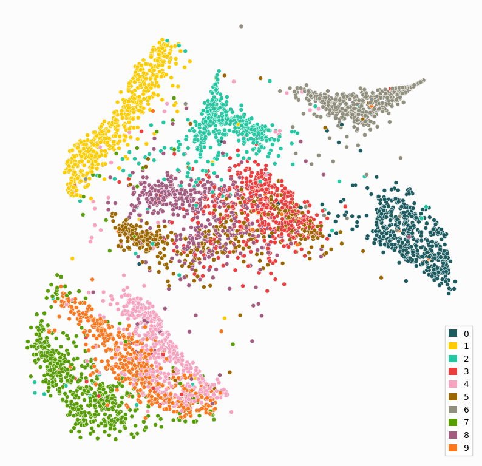
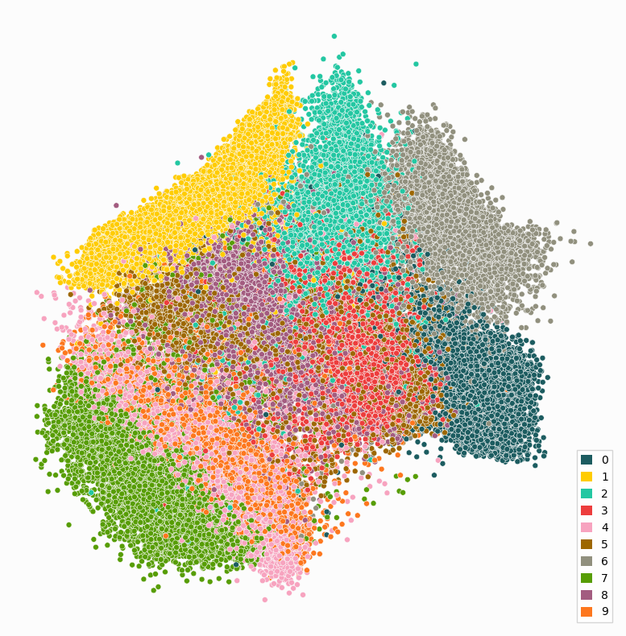

Parametric UMAP
---------------

In this example, we will set up a paraDime routine that is equivalent to a parametric implementation of UMAP. The predefined :class:`~paradime.routines.ParametricUMAP` routine is defined in a similar way. We will make use of the most important building blocks and methods of a :class:`~paradime.dr.ParametricDR` routine.

We start with some imports and define our dataset (MNIST handwritten image data):

.. literalinclude:: /../../examples/umap.py
   :language: python3
   :start-after: start-include-and-data
   :end-before: end-include-and-data

Relations
~~~~~~~~~

Next, we define the global relations. UMAP uses the pairiwse distances between eavh data point and its ``n``  nearest neighbors. The number of nearest neighbors ``n`` is a hyperparameter set by the user. The nearest neighbors are approximated using a tree-based algorithm. In paraDime, these approximate nearest neighbor relations are implemented in :class:`~paradime.relations.NeighborBasedPDist`. UMAP then rescales the distances based on a Gaussian kernel, with kernel widths calculated for each data point by summed comparing kernel values to the binary logarithm of ``n``. In paraDime, this transform is called :class:`~paradime.transforms.ConnectivityBasedRescale`. Both the :class:`~paradime.relations.NeighborBasedPDist` relations and the :class:`~paradime.transforms.ConnectivityBasedRescale` transform take a ``n_neighbors`` parameter, but if the tranform is used inside the relations, the enclosing relations will automatically use the same values, so we only have to specify ``n`` once. In this example, we fix ``n`` to 30:

.. literalinclude:: /../../examples/umap.py
   :language: python3
   :start-after: start-global-rel
   :end-before: end-global-rel

Note that we also added a :class:`~paradime.transforms.Symmetrize` transform. The ``subtract_product`` option makes sure that the correct symmetrization for UMAP is used.

Now we sdefine the batch-wise relations. Here, it iso important to understand that UMAP uses negative-edge sampling. This means, that the batch sampler (which we will specify later in on of the training phases) basically returns a list of pairs of indices of data points, which can be used to calculate the distances along the *edges* between those data points. (In contrast, regular sampling just returns a batch of item indices and assumes that all pairwise distances will be calculated.)
At the moment, the only relations compatible with negative edge sampling in paraDime are :class:`~paradime.relations.DistsFromTo`, which we use here:

.. literalinclude:: /../../examples/umap.py
   :language: python3
   :start-after: start-batch-rel
   :end-before: end-batch-rel

You can see that we transform the distances with a :class:`~paradime.transforms.ModifiedCauchyTransform`, which applies a slightly modified Cauchy distribution to the distances. The exact modification is controlled through the UMAP hyperparameters ``min_dist`` and ``spread``.

Routine and Training Phases
~~~~~~~~~~~~~~~~~~~~~~~~~~~

Having defined both the global and the batch-wise relations, we can now set up the routine itself:

.. literalinclude:: /../../examples/umap.py
   :language: python3
   :start-after: start-setup-dr
   :end-before: end-setup-dr

We use a subset of the MNIST dataset, and we want to use the GPU for training. We also set the ``verbose`` flag to see what's going on behind the scenes.

UMAP embeddings are initialized with a spectral embedding based on the computed relations between the data points. The usual way to perform an initialization step in paraDime is to set up an extra training phase in which the model is trained to embed the data in such a way that the embedding coordinates match a set of given positions. In t-SNE, these positions are simply the first two components of PCA. In UMAP, however, the positions used for initialization already require the computed relations.
Therefore, we now have to compute the global relations:

.. literalinclude:: /../../examples/umap.py
   :language: python3
   :start-after: start-compute-rel
   :end-before: end-compute-rel

Now we can use these relations to compute the spectral embedding. We simply use scikit-learn's :class:`sklearn.manifold.SpectralEmbedding` with our relations as ``'precomputed'`` affinities:

.. literalinclude:: /../../examples/umap.py
   :language: python3
   :start-after: start-add-spectral
   :end-before: end-add-spectral

Because spectral embeddings can sometimes have slightly weird value ranges, we standardized the coordinate. We thenn added the standardized coordinates to our routine's dataset under the ``'spectral'`` key, making use of the :meth:`~paradime.dr.ParametricDR.add_to_dataset` method.

We can now define an initializationt training phase that makes use of these coordinates in a :class:`~paradime.loss.PositionLoss`:

.. literalinclude:: /../../examples/umap.py
   :language: python3
   :start-after: start-setup-init
   :end-before: end-setup-init

Apart from the phase's name and the report interval, all other parameters are hyperparameters that specify the training. Note that for this initialization phase, we use standard sampling.

The main phase of the training should learn the embedding based on the relations, using negative-edge sampling:

.. literalinclude:: /../../examples/umap.py
   :language: python3
   :start-after: start-setup-main
   :end-before: end-setup-main

Due to the nature of the sampling, we have to define ourselves how many batches constitute an epoch (since samples are drawn with replacement, using edge relations as probabilities). UMAP uses a cross-entropy-like loss for comparing the global and batch-wise relations. This is implemented in paraDime as :func:`~paradime.loss.cross_entropy_loss`.

Training, Applying and Plotting
~~~~~~~~~~~~~~~~~~~~~~~~~~~~~~~

Now all that's left to do is add those training phases to our routine. Note that the :meth:`~paradime.dr.ParametricDR.add_training_phase` method does not only allows us to set a new phase's parameters individually, but also accepts a complete pre-defined :class:`~paradime.dr.TrainingPhase` instance. After adding the phases, we can call the roputine's :meth:`~paradime.dr.ParametricDR.train` method:

.. literalinclude:: /../../examples/umap.py
   :language: python3
   :start-after: start-training
   :end-before: end-training

Because we set the ``verbose`` flag, paraDime informs us about what's going on in the individual steps. Throughout this example, this leads to a log that looks something like the following:

.. literalinclude:: /../../examples/logs/umap.log
   :language: text

Once the training is complete, we can apply it to the training data:

.. literalinclude:: /../../examples/umap.py
   :language: python3
   :start-after: start-plot-train
   :end-before: end-plot-train

Of course we can also apply our parametric UMAP to the whole MNIST data, without having to retrain it:

Once the training is complete, we can apply our parametric UMAP to the training data:

.. literalinclude:: /../../examples/umap.py
   :language: python3
   :start-after: start-plot-rest
   :end-before: end-plot-rest

If you want to learn more about the individual steps, you can find more details in the section about the :ref:`building-blocks` or in the :ref:`api`.