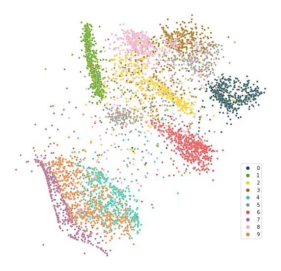

Getting Started
===============

paraDime is a flexible framework for specifiying parametric dimensionality reduction *routines*. A routine basically consists of a neural network, a dataset, and some instructions about what exactly paraDime should do yith your data to reduce its dimensionality.

paraDime has a flexible API with several predefined classes for each part of a routine, and each part can be fully customized by extending these existing classes. If you want to learn more about what exactly makes up a routine, see :ref:`building-blocks`.

But for now, the easiest way to get started with paraDime is to use on of the predefined routines. In the following short tutorial, we are going to train one of the predefined paraDime routines to reduce the dimensionality of data from the MNIST dataset of handwritten digits.

Importing paraDime and Loading the Dataset
------------------------------------------

First we import paraDime and torchvision, which gives us convenient access to the MNIST dataset.

.. code-block:: py

    import paradime
    import torchvision

    mnist = torchvision.datasets.MNIST(
        './data',
        train=True,
        download=True,
    )
    mnist_data = mnist.data.reshape(-1, 28*28) / 255.

Note that we have already flattened the image data into vectors of length 784 and normalized the values to a range between 0 and 1.

To make this tutorial more reproducible, we ask paraDime to set a number of seeds for several dufferent random number generators that might be used througout the routine:

.. code-block:: py

    paradime.utils.seed_all(42)

Importing a Predefined Routine
------------------------------

We now set up the paraDime routine we want to use. The predefined routines are located in the :ref:`mod-routines` submodule. Here, we use a parametric version of the t-SNE algorithm:

.. code-block:: py

    dr = paradime.routines.ParametricTSNE(
        perplexity=100,
        dataset=mnist_data[:5000],
        use_cuda=True,
    )

When initializing a routine, paraDime only needs minimal information to set up the underlying neural network. In this case we pass a subset of our MNIST data (5000 images). paraDime automatically infers the data dimensionality and sets up a default fully connected network for us. The default value for the output layer of the network (and thus the dimensionality to which our data will be reduced later) is 2, but you can overried this value using the ``out_dim`` parameter. paraDime also assumess some default values for the hidden layer dimensions of the network, so we don't have to care about that for now. Of course we could have also passed our own model (see :ref:`model`).

You might have noticed that we also pass a ``perplexity`` value, which is specific to the t-SNE algorithm.

Training the Routine and Visualizing the Results
------------------------------------------------

Since any other necessary bulding blocks are already predefined in this case, all that's left to do is to train the model. To do this, we simply call:

.. code-block:: py

    dr.train()

After the training is done, we can apply our trained model to the input data:

.. code-block:: py

    reduced = dr(mnist_data[:5000]).detach()

Not that PyTorch still keeps track of the gradients of the underlying model, so we use ``detach`` to remove our result from the computational graph. Before we look at the result, let's define a simple plotting function:

.. code-block:: py

    import seaborn as sns

    def plot_result(data, labels):
        palette = sns.color_palette(prdm.utils.get_color_palette().values())
        fig = plt.figure(figsize=(10,10))
        sp = sns.scatterplot(
            x=data[:,0],
            y=data[:,1],
            hue=labels,
            s=14.,
            alpha=1.,
            edgecolor="white",
            palette=palette
        )
        sp.tick_params(bottom=False, left=False)
        sp.set(xticklabels=[],yticklabels=[], aspect=1.)
        sns.despine(top=True, left=True, bottom=True, right=True)
        sns.move_legend(sp, "lower right", bbox_to_anchor=(.95,0.1))

Now we can plot the dimensionality-reduced data that we used for training:

.. code-block:: py

    plot_result(reduced, mnist.targets[:5000])

Because paraDime models are parametric, you can easily apply the trained model to the whole MNIST dataset, even though our routine only ever saw a small subset of it:

.. code-block:: py

    plot_result(dr(mnist_data).detach(), mnist.targets)

If you want to configure our own paraDime routines, you can read about what was going on behind the scenes when we set up and trained our routine in the next section, where we will look at the different :ref:`building-blocks` in detail.
