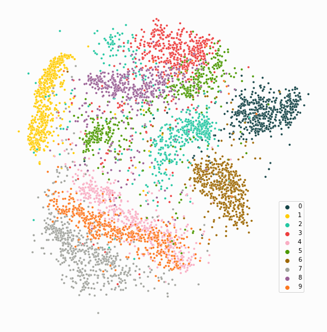
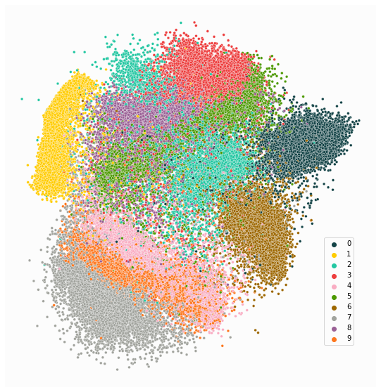

paraDime: A Framework for Parametric Dimensionality Reduction
=============================================================

paraDime is a modular framework for specifying and training parametric dimensionality reduction (DR) models. These models allow you to add new data points to existing low-dimensional representations of high-dimensional data. ParaDime DR models are constructed from simple building blocks (such as :ref:`relations` and :ref:`transforms`), so that experimentation with novel DR techniques becomes easy.

Here you can see a parametric version of t-SNE [1]_ trained on a subset of 5000 images of handwritten digits from the MNIST dataset [2]_:

The rest of the 60,000 images can then be easily embedded into the same space without retraining the t-SNE:

.. toctree::
   :maxdepth: 2
   :caption: User Guide

   installation
   getting_started
   building_blocks

.. toctree::
   :maxdepth: 2
   :caption: API Reference

   api/index

References
==========

.. [1] Van Der Maaten, L., Hinton, G. `“Visualizing data using t-SNE” <http://www.jmlr.org/papers/volume9/vandermaaten08a/vandermaaten08a.pdf>`__, Journal of Machine Learning Research (2008).

.. [2] LeCun, Y., Cortes, C., Burges, C.J.C. `“The MNIST database of handwritten digits” <http://yann.lecun.com/exdb/mnist/>`__ (1998).